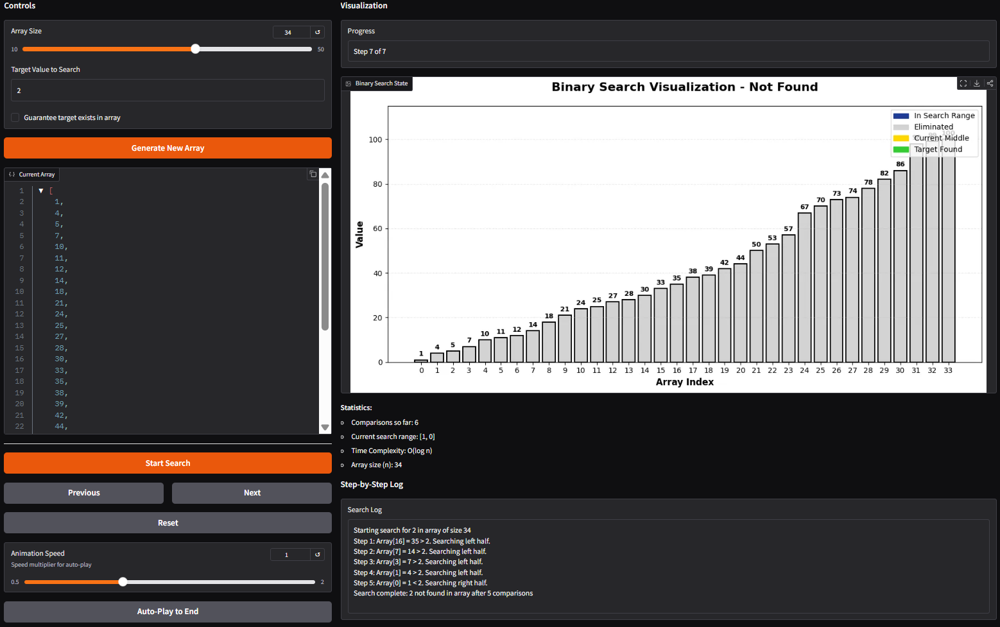
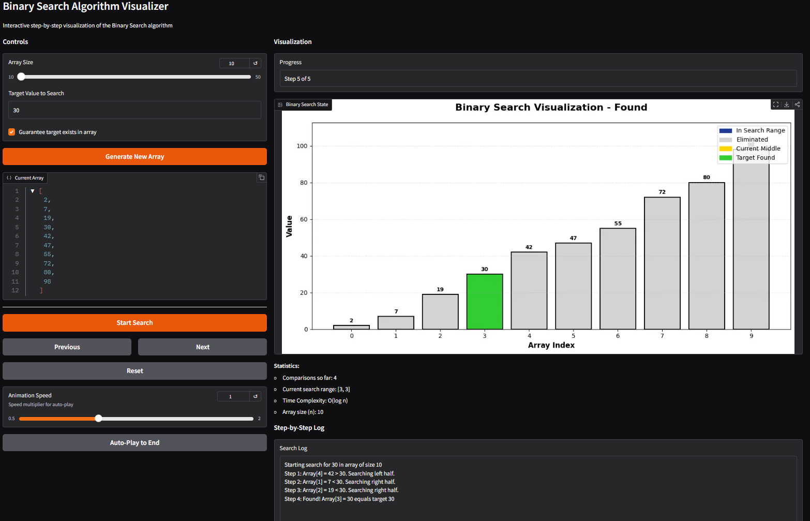

# Binary Search Visualizer

## Demo

Screenshots of test cases




## Problem Breakdown & Computational Thinking

### Why I Chose Binary Search

Binary search was the algorithm that stuck out to me the most when learning about it in class due to its interesting logic. The way it efficiently eliminates half of the search space in each step is fascinating and makes for a great visualization.

### Computational Thinking

**Decomposition:**
- Generate a sorted array
- Get target value from user
- Find middle element
- Compare middle element with target
- Decide to search left or right half
- Repeat until found or search space is empty

**Pattern Recognition:**
- Binary search always works on sorted arrays
- Each step divides the search space in half
- Uses left and right pointers to track search range
- Makes same comparison decision each time: equal, less than, or greater than

**Abstraction:**
- Show: Bars for elements in the array , current search range (Blue), middle element (Yellow), eliminated sections (Grey), step-by-step log
- Hide: index calculations, memory details, Python list implementation

**Algorithm Design:**
- Input: array size, target value, option to guarantee target exists
- Processing: generate sorted array, run binary search step-by-step, record each comparison
- Output: visual bar chart, statistics, step log, navigation controls

### Flowchart

```
START
|
Generate sorted array and get target
|
Set left = 0, right = array length - 1
|
Is left <= right?  --> NO --> Target not found, END
|
YES
|
Calculate mid = (left + right) / 2
|
Compare array[mid] with target
|
|--> Equal? --> Found! END
|
|--> Less than? --> Set left = mid + 1, go back to "Is left <= right?"
|
|--> Greater than?--> Set right = mid - 1, go back to "Is left <= right?"
```

## Steps to Run

1. Install Python (latest version)

2. Install dependencies in requirements.txt:
```
pip install -r requirements.txt
```

3. Run the app:
```
python app.py
```

4. Open the browser site with the link given in the terminal

5. Using the app:
   - Set array size and target value (Choice if target is guaranteed to be in array)
   - Click "Generate New Array"
   - Click "Start Search"
   - Use Next/Previous/Reset buttons or Auto-Play to see the algorithm work

## Hugging Face Link

(Will be added after deployment)

## Testing & Verification

Successful tested cases:

- Target in middle of array 
- Target at the start, end of array
- Target not in array 
- Array with 10 elements
- Array with 50 elements
- Auto-play at different speeds 

screenshots included above

## Author

Brandon Yip
CISC121 
2025-12-09

Acknowledgments:
- Professor Ruslan Kain
- Gradio
- Matplotlib (For bar graphics & visualisation)

